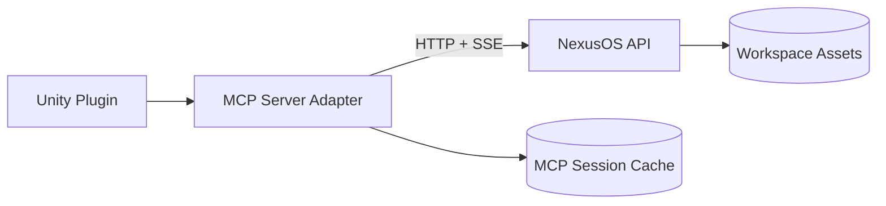

# Unity MCP Server Contract for NexusOS

This document is the implementation contract for a separate Unity plugin project that talks to NexusOS through an MCP server layer.

## Scope

- Unity editor tooling that requests generated assets from NexusOS.
- MCP server acts as adapter between Unity and NexusOS REST/SSE endpoints.
- Contract favors predictable payloads, resumable jobs, and explicit workspace ownership.

## Architecture



## Transport and Session Rules

- NexusOS base URL default for the Pinokio launcher: `http://127.0.0.1:18080`
- Concrete Unity transport: localhost HTTP bridge mounted at `/api/unity` in the NexusOS API.
- MCP server should require a short-lived session token from Unity.
- MCP server should send token to NexusOS as `X-Nexus-Session` if you add server-side verification later.
- All tool inputs accept optional `workspaceId`; default is `default`.
- All returned file references must include both:
  - `relativePath`
  - `downloadUrl`

### Implemented Unity HTTP Bridge

The bridge converts NexusOS SSE generation into pollable jobs so Unity can survive assembly reloads without owning the raw generator stream.

- `POST /api/unity/session` creates a short-lived token.
- Authenticated calls send the token as `X-Nexus-Session`.
- `GET /api/unity/status` normalizes NexusOS and runtime readiness.
- `POST /api/unity/tools/nexus.generate.image` starts `nexus.generate.image` and returns a job.
- `GET /api/unity/jobs` lists recent jobs.
- `GET /api/unity/jobs/:id` returns progress and the final MCP-shaped result.
- `POST /api/unity/jobs/:id/cancel` cancels the upstream SSE operation.
- `GET /api/unity/assets` exposes the image library for the selected workspace.

The bridge rejects non-loopback clients. Runtime probes use bounded timeouts and report partial readiness instead of blocking the entire status response.

## Standard MCP Result Shapes

### Success envelope

```json
{
  "ok": true,
  "workspaceId": "default",
  "requestId": "optional-uuid",
  "data": {}
}
```

### Error envelope

```json
{
  "ok": false,
  "error": {
    "code": "runtime_not_ready",
    "message": "Wan2GP is not ready yet.",
    "retryable": true,
    "details": {}
  }
}
```

### Stream event envelope

NexusOS stream endpoints already emit SSE frames that look like this:

```json
{ "type": "status", "message": "..." }
{ "type": "done", "result": { "...": "..." } }
{ "type": "error", "message": "..." }
```

MCP should forward progress as tool progress updates and return the final `done.result` in the success envelope.

## Tool Contract

The names below are the recommended MCP tool names for Unity integration.

### 1) nexus.status

Purpose:
- Validate API connectivity.
- Fetch Wan2GP, Hunyuan3D, and Animato readiness and model recommendations.

Input schema:

```json
{
  "type": "object",
  "properties": {},
  "additionalProperties": false
}
```

NexusOS calls:
- `GET /api/health`
- `GET /api/tools/wan2gp/status`
- `GET /api/tools/hunyuan3d/status`
- `GET /api/tools/animation/status`

Output data shape:

```json
{
  "health": { "ok": true },
  "wan2gp": {
    "apiReady": true,
    "recommended": {
      "profile": 4,
      "video": {
        "model": "auto",
        "width": 640,
        "height": 384,
        "steps": 6,
        "durationSeconds": 3,
        "fps": 16,
        "frameCount": 49,
        "presetId": "compat-fast"
      }
    },
    "videoPresets": [],
    "h3Detected": false
  },
  "hunyuan3d": {
    "apiReady": true
  },
  "animato": {
    "apiReady": true,
    "baseUrl": "http://127.0.0.1:8010"
  }
}
```

### 2) nexus.runtime.ensure

Purpose:
- Ensure required runtime is installed/started before generation.

Input schema:

```json
{
  "type": "object",
  "required": ["target"],
  "properties": {
    "target": {
      "type": "string",
      "enum": ["wan2gp", "hunyuan3d", "animato"]
    },
    "refreshBase": { "type": "boolean", "default": false }
  },
  "additionalProperties": false
}
```

Behavior:
- For `wan2gp`:
  - if `refreshBase=true`, run install job unconditionally (refreshes upstream base)
  - then run start job
- For `hunyuan3d`:
  - run install job if needed
  - then run start job
- For `animato`:
  - run install job if needed
  - then run start job

NexusOS calls:
- `POST /api/tools/runtimes/jobs` with action `install-wan2gp`, `start-wan2gp`, `install-hunyuan3d`, `start-hunyuan3d`, `install-animato`, `start-animato`
- `GET /api/tools/runtimes/jobs/:jobId` until terminal status

Terminal statuses:
- success: `completed`
- failure: `failed` or `canceled`

### 3) nexus.generate.image

Purpose:
- Generate and persist an image asset in workspace.

Input schema:

```json
{
  "type": "object",
  "required": ["prompt"],
  "properties": {
    "workspaceId": { "type": "string", "default": "default" },
    "prompt": { "type": "string", "minLength": 1 },
    "negativePrompt": { "type": "string" },
    "model": { "type": "string", "default": "auto" },
    "width": { "type": "integer", "minimum": 256, "maximum": 1280, "default": 768 },
    "height": { "type": "integer", "minimum": 256, "maximum": 1280, "default": 768 },
    "steps": { "type": "integer", "minimum": 1, "maximum": 60, "default": 6 },
    "seed": { "type": "integer", "default": -1 },
    "profile": { "type": "integer", "minimum": 1, "maximum": 5, "default": 4 }
  },
  "additionalProperties": false
}
```

NexusOS call:
- `GET /api/tools/wan2gp/image/stream` (SSE)

Output data shape:

```json
{
  "asset": {
    "kind": "image",
    "provider": "wan2gp",
    "model": "string",
    "workspaceId": "default",
    "relativePath": "Assets/images/...png",
    "downloadUrl": "/api/tools/wan2gp/file?...",
    "width": 768,
    "height": 768,
    "steps": 6,
    "seed": 123,
    "profile": 4,
    "prompt": "...",
    "negativePrompt": "..."
  }
}
```

### 4) nexus.generate.video

Purpose:
- Generate and persist a video asset in workspace.

Input schema:

```json
{
  "type": "object",
  "required": ["prompt"],
  "properties": {
    "workspaceId": { "type": "string", "default": "default" },
    "prompt": { "type": "string", "minLength": 1 },
    "negativePrompt": { "type": "string" },
    "model": { "type": "string", "default": "auto" },
    "width": { "type": "integer", "minimum": 320, "maximum": 1024, "default": 640 },
    "height": { "type": "integer", "minimum": 192, "maximum": 1024, "default": 384 },
    "steps": { "type": "integer", "minimum": 1, "maximum": 60, "default": 6 },
    "durationSeconds": { "type": "integer", "minimum": 1, "maximum": 12, "default": 3 },
    "fps": { "type": "integer", "minimum": 8, "maximum": 32, "default": 16 },
    "frameCount": { "type": "integer", "minimum": 17, "maximum": 193, "default": 49 },
    "seed": { "type": "integer", "default": -1 },
    "profile": { "type": "integer", "minimum": 1, "maximum": 5, "default": 4 }
  },
  "additionalProperties": false
}
```

NexusOS call:
- `GET /api/tools/wan2gp/video/stream` (SSE)

Output data shape:

```json
{
  "asset": {
    "kind": "video",
    "provider": "wan2gp",
    "model": "string",
    "workspaceId": "default",
    "relativePath": "Assets/videos/...mp4",
    "downloadUrl": "/api/tools/wan2gp/file?...",
    "width": 640,
    "height": 384,
    "steps": 6,
    "durationSeconds": 3,
    "fps": 16,
    "frameCount": 49,
    "seed": 123,
    "profile": 4,
    "prompt": "...",
    "negativePrompt": "..."
  }
}
```

H3 behavior note:
- When `model=auto`, NexusOS now prioritizes MiniMax H3-compatible installed models and exposes tuned `videoPresets` in status.

### 5) nexus.generate.model3d

Purpose:
- Generate initial 3D mesh from image or text-to-image pipeline.

Input schema:

```json
{
  "type": "object",
  "properties": {
    "workspaceId": { "type": "string", "default": "default" },
    "imageUrl": { "type": "string" },
    "imageBase64": { "type": "string" },
    "textPrompt": { "type": "string" },
    "textNegativePrompt": { "type": "string" },
    "textImageModel": { "type": "string", "default": "auto" },
    "textImageWidth": { "type": "integer", "default": 768 },
    "textImageHeight": { "type": "integer", "default": 768 },
    "textImageSteps": { "type": "integer", "default": 6 },
    "textImageProfile": { "type": "integer", "default": 4 },
    "textImageSeed": { "type": "integer", "default": -1 },
    "modelPath": { "type": "string", "default": "tencent/Hunyuan3D-2mini" },
    "subfolder": { "type": "string", "default": "hunyuan3d-dit-v2-mini-turbo" },
    "numInferenceSteps": { "type": "integer", "default": 20 },
    "octreeResolution": { "type": "integer", "default": 192 },
    "guidanceScale": { "type": "number", "default": 5.0 },
    "seed": { "type": "integer", "default": -1 },
    "format": { "type": "string", "enum": ["glb", "obj"], "default": "glb" }
  },
  "additionalProperties": false
}
```

NexusOS call:
- `POST /api/tools/hunyuan3d/generate/stream` (SSE)

Output data shape:

```json
{
  "asset": {
    "kind": "model3d",
    "provider": "hunyuan3d",
    "workspaceId": "default",
    "relativePath": "Assets/models/...glb",
    "downloadUrl": "/api/tools/hunyuan3d/file?...",
    "format": "glb",
    "sourceKind": "image|text",
    "sourceImageUrl": "optional"
  }
}
```

### 6) nexus.finish.model3d

Purpose:
- Run Blender finishing pipeline on an existing mesh.

Input schema:

```json
{
  "type": "object",
  "required": ["workspaceId", "relativePath"],
  "properties": {
    "workspaceId": { "type": "string" },
    "relativePath": { "type": "string" },
    "outputFormat": { "type": "string", "enum": ["glb", "obj"], "default": "glb" },
    "profile": {
      "type": "string",
      "enum": ["draft", "game-ready-low", "game-ready-med", "game-ready-high"],
      "default": "game-ready-med"
    },
    "sourceImageUrl": { "type": "string" },
    "sourceRelativePath": { "type": "string" }
  },
  "additionalProperties": false
}
```

NexusOS call:
- `POST /api/tools/hunyuan3d/finish/stream` (SSE)

Output data shape:

```json
{
  "asset": {
    "kind": "model3d",
    "provider": "blender-headless",
    "workspaceId": "default",
    "relativePath": "Assets/models/...glb",
    "downloadUrl": "/api/tools/hunyuan3d/file?...",
    "format": "glb",
    "profile": "game-ready-med",
    "sourceTextureApplied": true
  }
}
```

### 7) nexus.generate.audio

Purpose:
- Generate and persist music or SFX clips in workspace.

Input schema:

```json
{
  "type": "object",
  "required": ["mode", "prompt"],
  "properties": {
    "workspaceId": { "type": "string", "default": "default" },
    "mode": {
      "type": "string",
      "enum": ["small-music", "small-sfx", "medium"],
      "default": "small-music"
    },
    "prompt": { "type": "string", "minLength": 1 },
    "duration": { "type": "integer", "minimum": 1, "maximum": 380, "default": 30 },
    "fileName": { "type": "string" }
  },
  "additionalProperties": false
}
```

NexusOS calls:
- `GET /api/tools/music/stable-audio/status`
- `POST /api/tools/music/stable-audio/generate`

Validation rules:
- `small-music` and `small-sfx` max duration is 120 seconds.
- `medium` max duration is 380 seconds.

Output data shape:

```json
{
  "asset": {
    "kind": "audio",
    "provider": "stable-audio",
    "mode": "small-sfx",
    "workspaceId": "default",
    "relativePath": "Assets/music/...wav",
    "downloadUrl": "/api/tools/music/file?...",
    "duration": 8,
    "prompt": "retro coin pickup, short, clean tail"
  }
}
```

### 8) nexus.generate.animation

Purpose:
- Generate one or more animation variations from a rigged source model.

Input schema:

```json
{
  "type": "object",
  "required": ["prompt", "sourceRelativePath"],
  "properties": {
    "workspaceId": { "type": "string", "default": "default" },
    "prompt": { "type": "string", "minLength": 1 },
    "sourceRelativePath": { "type": "string", "minLength": 1 },
    "variations": { "type": "integer", "minimum": 1, "maximum": 5, "default": 1 },
    "harnessId": { "type": "string" }
  },
  "additionalProperties": false
}
```

NexusOS calls:
- `GET /api/tools/animation/status`
- `POST /api/tools/animation/generate/stream` (SSE)

Requirements:
- `sourceRelativePath` must point to a rigged `glb`, `gltf`, or `fbx`.

Output data shape:

```json
{
  "assets": [
    {
      "kind": "animation",
      "provider": "animato",
      "variation": 1,
      "workspaceId": "default",
      "relativePath": "Assets/models/animato-...-v1.glb",
      "downloadUrl": "/api/tools/hunyuan3d/file?...",
      "format": "glb",
      "prompt": "stylized run cycle with heavy anticipation"
    }
  ]
}
```

### 9) nexus.assets.list

Purpose:
- List generated files for Unity pickers/import queues.

Input schema:

```json
{
  "type": "object",
  "properties": {
    "workspaceId": { "type": "string", "default": "default" },
    "subpath": { "type": "string", "default": "Assets" },
    "kinds": {
      "type": "array",
      "items": {
        "type": "string",
        "enum": ["images", "videos", "models", "music"]
      }
    }
  },
  "additionalProperties": false
}
```

NexusOS call:
- `GET /api/workspaces/:id/tree`

Output data shape:

```json
{
  "assets": [
    {
      "kind": "image",
      "relativePath": "Assets/images/foo.png",
      "fileName": "foo.png",
      "downloadUrl": "/api/tools/wan2gp/file?..."
    }
  ]
}
```

Mapping rules:
- `Assets/images/*` => image endpoint URL
- `Assets/videos/*` => media endpoint URL
- `Assets/models/*` => hunyuan3d file endpoint URL
- `Assets/music/*` => music file endpoint URL

### 10) nexus.asset.fetch

Purpose:
- Return one asset as base64 or a direct URL for UnityWebRequest download.

Input schema:

```json
{
  "type": "object",
  "required": ["workspaceId", "relativePath"],
  "properties": {
    "workspaceId": { "type": "string" },
    "relativePath": { "type": "string" },
    "mode": { "type": "string", "enum": ["url", "base64"], "default": "url" }
  },
  "additionalProperties": false
}
```

NexusOS calls:
- URL mode: map by extension to file endpoint (`/api/tools/wan2gp/file`, `/api/tools/hunyuan3d/file`, `/api/tools/music/file`, `/api/tools/image/local/file`)
- base64 mode fallback: `GET /api/workspaces/:id/file?relativePath=...`

Output data shape:

```json
{
  "asset": {
    "workspaceId": "default",
    "relativePath": "Assets/models/foo.glb",
    "mimeType": "model/gltf-binary",
    "downloadUrl": "/api/tools/hunyuan3d/file?...",
    "base64": "optional"
  }
}
```

## Runtime Job Polling Contract

When MCP launches runtime jobs, expose this normalized state to Unity:

```json
{
  "job": {
    "id": "uuid",
    "action": "install-wan2gp",
    "status": "queued|running|canceling|completed|failed|canceled",
    "createdAt": "iso",
    "updatedAt": "iso",
    "finishedAt": "iso-or-null",
    "logs": ["..."]
  }
}
```

## Recommended Unity Import Flow

1. Call `nexus.status`.
2. Call `nexus.runtime.ensure` if runtime is not ready.
3. Call generation tool (`nexus.generate.image`, `nexus.generate.video`, `nexus.generate.model3d`, `nexus.generate.audio`, or `nexus.generate.animation`).
4. Receive `relativePath` and `downloadUrl`.
5. Download bytes in Unity and save into Unity project under `Assets/Generated/Nexus/...`.
6. Trigger AssetDatabase refresh/import.
7. Cache metadata in plugin state for reimport/resume.

## Unity Import Settings Matrix

Use these defaults when importing generated Nexus assets into Unity.

### Audio (Stable Audio output)

| Asset kind | Typical use | Load Type | Compression Format | Quality | Sample Rate | Force To Mono | Preload Audio Data | Load In Background |
| --- | --- | --- | --- | --- | --- | --- | --- | --- |
| music (`small-music`/`medium`) | BGM / ambience loops | Compressed In Memory | Vorbis | 0.65-0.80 | Preserve | Off | On | On |
| sfx (`small-sfx`) | UI and gameplay one-shots | Decompress On Load | ADPCM (or PCM for ultra-short UI ticks) | n/a for ADPCM | Optimize | On (unless clearly stereo) | On | Off |

Recommended Unity plugin behavior:
- If generated clip duration is <= 10s and mode is `small-sfx`, apply SFX profile.
- Otherwise apply Music profile.

### Animated Models (Animato output)

| Asset kind | Preferred container | Import Animation | Rig | Animation Type | Avatar Definition | Compression | Notes |
| --- | --- | --- | --- | --- | --- | --- | --- |
| animato variation | glb/gltf | On | Generic (or Humanoid if project requires retargeting) | Legacy Off | Create From This Model | Keyframe Reduction (moderate) | Keep source and generated model scale consistent |

Recommended Unity plugin behavior:
- Detect generated animation files by `Assets/models/animato-*-v*.glb` naming.
- Enable ModelImporter animation clip import and generate one clip per take.
- Keep root transform bake policy project-defined (do not hardcode unless team requests).
- If multiple variations are returned, auto-group them into a generated animation set asset.

## Error Handling Requirements

- Treat network disconnects and SSE `type=error` as retryable unless NexusOS reports validation errors.
- Validation errors (`400`) are non-retryable.
- Policy errors (`412`) are non-retryable until policy changes.
- Runtime unready errors are retryable after `nexus.runtime.ensure`.

## Security Requirements

- Limit MCP server bind address to localhost by default.
- Do not allow arbitrary file reads outside selected workspace.
- Validate `relativePath` and reject traversal patterns.
- Redact secrets in logs.
- Add per-session token rotation if Unity editor restarts.

## Implementation Checklist for Unity Team

- Implement all 10 MCP tools above.
- Implement SSE parser with `status`, `done`, `error` support.
- Implement runtime job poll loop for ensure/install/start flows.
- Implement direct URL download + base64 fallback.
- Implement deterministic import destination mapping by file kind.
- Add timeout and cancellation wiring from Unity UI to MCP requests.
- Add telemetry fields: `requestId`, duration ms, retry count, final status.
- Implement Unity import defaults from the audio + animation matrix.

## Known Current API Notes

- `GET /api/tools/wan2gp/status` now provides H3-aware recommendation and `videoPresets`.
- Running runtime job action `install-wan2gp` refreshes Wan2GP base from upstream.
- Media generation and Hunyuan generation are SSE streams and should not be treated as plain JSON endpoints.
- Stable Audio music/SFX generation is request/response JSON (not SSE) at `POST /api/tools/music/stable-audio/generate`.
- Animato generation is SSE at `POST /api/tools/animation/generate/stream` and returns one or more clip assets in `done.result.clips`.
